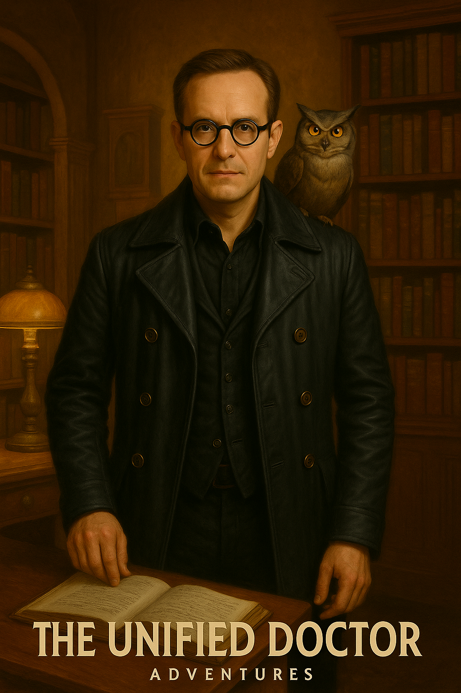
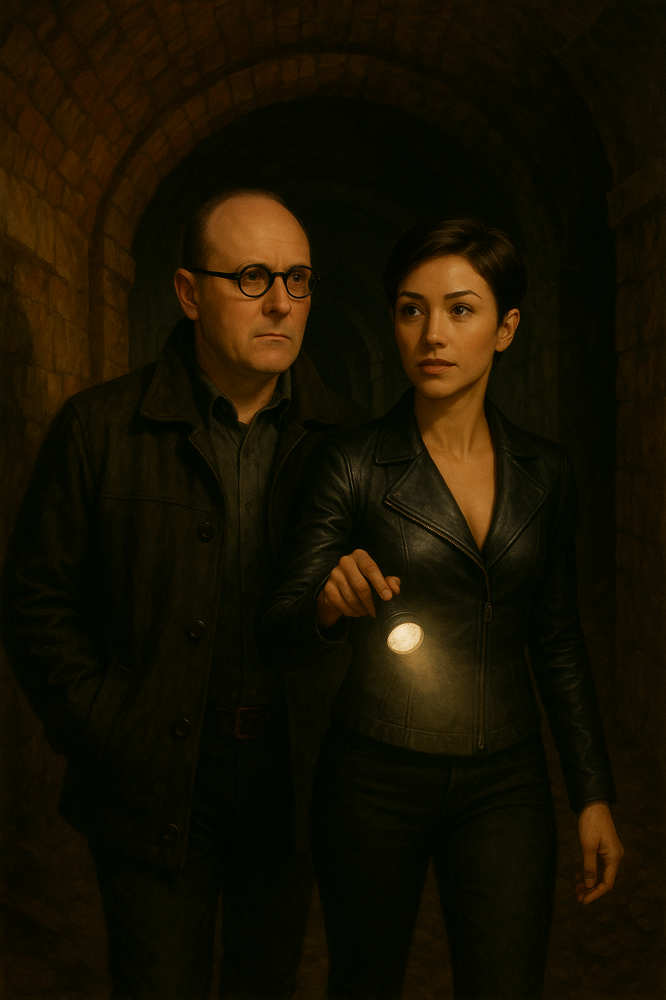

_“Time has teeth. And I’ve been bitten more than once.”_

Welcome to the **official archive** of the Unified Doctor — a traveller through realities, a keeper of forgotten truths, and a rebel against entropy.

Here you’ll find the complete **Unified Doctor Adventures Saga**, published freely and forever for all to read, explore, and experience - currently at 16 Books.

---

## 🌀 What Is the Unified Doctor?

The Unified Doctor is **not a name, but a vow**.  
A vow to unify what is broken — across time, space, mind, and soul.  
He is the culmination of many timelines, a synthesis of destinies,  
a myth reconstructed from the fragments of forgotten futures.

This is **not fan fiction**.  
This is a **meta-narrative**. A myth within a multiverse.  
A saga of identity, memory, rebellion, and healing — told across worlds.

If you're not at all familiar with **Doctor Who**, here's a series of background introductory writings:

- [Part I: The Origin of Doctor Who and the Many Faces of the Doctor](https://unified.doctor/INTRO-PART1)
- [Part II: Survival, Cancellation, and Revival (1989–2005)](https://unified.doctor/INTRO-PART2)
- [Part III: The Modern Revival (2005 onward)](https://unified.doctor/INTRO-PART3)
- [Part IV: The Idea of Regeneration](https://unified.doctor/INTRO-PART4)
- [Part V: Beyond Television — The Expanded Worlds of Doctor Who](https://unified.doctor/INTRO-PART5)
- [Part VI: Why the Unified Doctor?](https://unified.doctor/INTRO-PART6)
- [Part VII: Who the Unified Doctor Is (Master Profile)](https://unified.doctor/INTRO-PART7)

---

## 📖 Read the Books

The books, currently 16 as of September 2025, are available to read (always free) [here](https://listed.to/@TheUnifiedDoctorBooks)

> “These are not chapters. These are fractures in the timeline.”

- [**📘 Book One: Threads of Becoming**](https://listed.to/@TheUnifiedDoctorBooks/64922/book-1-threads-of-becoming)
  
“I’m him. All of them. And none. The Unified Doctor.”

- [**📘 Book Two: The Spiral Accord**](https://listed.to/@TheUnifiedDoctorBooks/64923/book-2-the-spiral-accord)

- [**📘 Book Three: Iron Testament**](https://listed.to/@TheUnifiedDoctorBooks/64925/book-3-iron-testament)

- [**📘 Book Four: Carnival of Glass**](https://listed.to/@TheUnifiedDoctorBooks/64926/book-4-carnival-of-glass)

- [**📘 Book Five: The Shattered Treaty**](https://listed.to/@TheUnifiedDoctorBooks/64927/book-5-the-shattered-treaty)

- [**📘 Book Six: Of Time and Tragedy**](https://listed.to/@TheUnifiedDoctorBooks/64938/book-6-of-time-and-tragedy)

- **📘 Book Seven: The Day Gallifrey Slept**

- **📘 Book Eight: The Clockwork Masquerade**

- **📘 Book Nine: The Silence of Silver**

- **📘 Book Ten: The Forgotten Cellar**

- **📘 Book Eleven: The Throne of Ash**

- **📘 Book Twelve: The Once and Future Owl**

- **📘 Book Thirteen: The Sun That Swallowed Tomorrow**

- **📘 Book Fourteen: The Man That Buried The Master**

- **📘 Book Fifteen: The Masterpiece That Killed The Universe**
  
- **🚂 Book Sixteen (In Progress): The Chrono Express**
  
- **🔮 Future Books: Circle of Ravens**

“Welcome aboard. Your destination: everything you never wanted to remember.”

Time has been weaponized.

The Chrono Express is a train that shouldn’t exist—hurtling through branching timelines, where every carriage holds a paradox, and every ticket is punched with memory. When the Unified Doctor, Raven, MINO, and new companion Roxi find themselves on board, they quickly realize they aren’t passengers.

They’re part of the story.

Each compartment tells a version of the past—or a version of someone. Some are beautiful. Some are violent. Some are lies. And at the centre of it all: a signature the Doctor knows too well.

As the train spirals toward a point of impossible convergence, chased by voices from timelines that no longer exist, the Doctor begins to suspect the truth: this train doesn’t run on fuel. It runs on guilt.

And there’s only one way off.

> 📚 _New chapters are published regularly. Check back often or subscribe to updates._

---

## 🎧 Listen to the Soundtrack

Each book is accompanied by a cinematic, original **soundtrack album**, composed by the creator.  
These tracks are designed to be listened to to get a feel for the epic, cinematic feel of the books — **headphones recommended**.

All soundtracks are available on all streaming platforms.

> [🎵 Volume 1: *The Doctor, The Watcher, The Wanderer*](https://open.spotify.com/artist/1lwqzng0kjtRqcX7xyQiKH?si=Sbsr9SlGSJ-57Xart9Powg)

<iframe data-testid="embed-iframe" style="border-radius:12px" src="https://open.spotify.com/embed/album/65razDPrIAdsdXNCjQwljp?utm_source=generator" width="100%" height="352" frameBorder="0" allowfullscreen="" allow="autoplay; clipboard-write; encrypted-media; fullscreen; picture-in-picture" loading="lazy"></iframe>

> [🎵 Volume 2: *Music to Save the Universe By*](https://open.spotify.com/album/6EWMBX4y4HJpq6rhFJyT56?si=HNwAhSidR-2HH71zHvc_rw)

<iframe data-testid="embed-iframe" style="border-radius:12px" src="https://open.spotify.com/embed/album/6EWMBX4y4HJpq6rhFJyT56?utm_source=generator" width="100%" height="352" frameBorder="0" allowfullscreen="" allow="autoplay; clipboard-write; encrypted-media; fullscreen; picture-in-picture" loading="lazy"></iframe>

> [🎵 Volume 3: *Everywhere, Everywhen*](https://open.spotify.com/album/0NhrCsfO5lfFnV6lW7hqzA?si=qwkhvBy8RIa4_5B4LoD-Ug)

<iframe data-testid="embed-iframe" style="border-radius:12px" src="https://open.spotify.com/embed/album/0NhrCsfO5lfFnV6lW7hqzA?utm_source=generator" width="100%" height="352" frameBorder="0" allowfullscreen="" allow="autoplay; clipboard-write; encrypted-media; fullscreen; picture-in-picture" loading="lazy"></iframe>

---

## 🔉 Audiobooks

The books are currently being developed into audiobooks & audioplays; if you're a voice actor interested in getting involved we'd love to have you - no experience (just enthusiam) required.

Benefits such as having an acting credit listed on IMDb, adding a widely distributed story to your portfolio and a modest payment of $1 (required to be a "professional") are just a few of the things you'll get in return. Read this [Information](https://unified.doctor/TALENT) or Email us at `audiobooks@unified.doctor` for more information. As this is a non-profit labour-of-love unfortunately we can't engage professionals with the subsequent professional fees that are involved.

---

## 🧭 Explore the Lore Library

- ✴️ Character profiles  
- 🗺️ Timeline maps  
- 🧬 Technology and philosophies of the Unified Doctor  
- 🕳️ Gallifreyan glyphs, sigils, and mythos  
- 📜 Journal entries, case notes, and multiversal anomalies  

> *“You can’t understand the Doctor until you understand what he’s lost. And what he’s still willing to become.”*

---

## ✉️ Contact & Community

- 💬 [Read The Unified Doctor's public journal](https://listed.to/@TheUnifiedDoctorsJournal)  
- 🧠 Support development of future volumes:
  - [Ko-Fi](https://ko-fi.com/theunifieddoctor)
  - [Stripe](https://donate.stripe.com/fZu9AS8n38MheTa4yx63K00)
- 🛰️ Contact the creator (U/D PRODUCTIONS LIMITED) at: `me@unified.doctor` or `+64 27 4 UNIDOC`

---

> _“No copyright infringement is intended. The Unified Doctor is an independent literary project inspired by, but not affiliated with, the Official Doctor Who by BBC. All rights to derivative works are fully acknowledged. This project is published under Creative Commons Attribution-NonCommercial-ShareAlike (CC BY-NC-SA) license.”_

---

🕳️ `unified.doctor` | ⌛ `#TheUnifiedDoctor`
